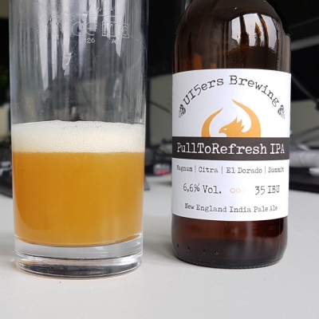

# UI5ersBrewing

## Content
This repository contains the beer [recipe for the "PullToRefresh IPA"](docs/PullToRefresh_IPA_recipe.md) (brewed for UI5con@SAP 2017) and related resources.
Feel free to fork and adapt the recipe and brew the beer on your own!

Basic knowledge about the homebrewing process is assumed, this repository will not teach the basics of brewing.

## The Beer
The PullToRefresh IPA is a "New England India Pale Ale". This new beer style originating from north-eastern USA tastes typically more fruity and less bitter than regular IPAs and has a quite hazy appearance, visually supporting the fruity taste.  
This particular beer has a fruity (citrus/orange), but also spicy aroma and taste, resulting from the hop varieties Citra®, El Dorado®, and Summit™.

## License
The content is made available under the Apache 2.0 license (see license.txt), which is not the most suitable one for text documents, but in line with the license under which the OpenUI5 framework is released.

Note that all content is result of a private effort and not endorsed or produced by SAP!
